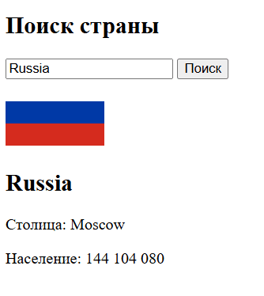

## Поиск страны (REST Countries API)

1. **Переменные**
    
    - `API_BASE` – `https://restcountries.com/v3.1/name/` [REST Countries](https://restcountries.com/?utm_source=chatgpt.com).
        
    - `input` – поле для ввода названия страны.
        
    - `button` – кнопка «Поиск».
        
    - `resultEl` – контейнер для отображения результата.
        
2. **Функция поиска (`searchCountry`)**
    
    - Считать `name` из `input.value` (trim).
        
    - Если пусто – выход из функции.
        
    - Установить `resultEl.textContent = 'Загрузка…'`.
        
    - Выполнить `fetch(API_BASE + name)` и проверить `response.ok`.
        
    - Парсить JSON, взять первый элемент массива.
        
    - Собрать HTML с флагом (`flags.svg`), `name.common`, `capital[0]`, `population`.
        
    - Вставить в `resultEl`.
        
    - В `catch` вывести «Страна не найдена.»
        
3. **Событие**
    
    - `button.addEventListener('click', searchCountry)`
        
4. **HTML/CSS**
    
    - Грид‑контейнер с полем поиска и результатом.
        
    - Карточка для результата с изображением и текстом.

Примерный итоговый результат
