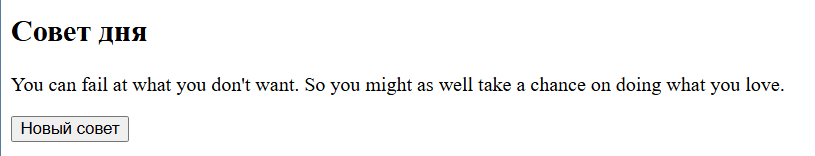

## 2. Случайный совет (Advice Slip API)

1. **Переменные**
    
    - `API_URL` – `https://api.adviceslip.com/advice` [api.adviceslip.com](https://api.adviceslip.com/?utm_source=chatgpt.com).
        
    - `adviceEl` – DOM‑элемент `<blockquote>` для показа текста.
        
    - `button` – кнопка «Новый совет».
        
2. **Функция загрузки (`fetchAdvice`)**
    
    - Заменить содержимое `adviceEl` на «Загрузка…».
        
    - Выполнить `fetch(API_URL)` [PublicAPI](https://publicapi.dev/advice-slip-api?utm_source=chatgpt.com).
        
    - Парсить JSON, взять `slip.advice`.
        
    - Вставить текст в `adviceEl`.
        
    - В `catch` вывести «Ошибка. Попробуйте снова.»
        
3. **События и запуск**
    
    - `button.addEventListener('click', fetchAdvice)`
        
    - Вызвать `fetchAdvice()` при старте страницы.
        
4. **HTML/CSS**
    
    - `<section>` с заголовком, `<blockquote>` и кнопкой.
        
    - Простой центрированный макет, лёгкий italics‑стиль для блока совета.

Совет: возможно понадобиться обернуть весь js код в функцию
```js
document.addEventListener('DOMContentLoaded', () => {
})
```
Примерный итоговый результат
