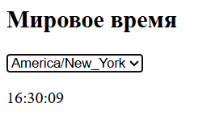

## Часы мирового времени (World Time API)

1. **Переменные**
    
    - Массив `timezones` с несколькими зонами (например, `Europe/London`, `Asia/Tokyo`).
        
    - `select` – `<select>` для выбора зоны.
        
    - `display` – абзац для показа времени.
        
    - Переменная `timerId` для хранения `setInterval`.
        
2. **Инициализация списка**
    
    - Через `timezones.forEach` создавать `<option>` с `value = зона` и текстом.
        
3. **Функция обновления (`updateTime`)**
    
    - Считать `zone = select.value`.
        
    - Сделать `fetch('http://worldtimeapi.org/api/timezone/' + zone)` [worldtimeapi.org](https://worldtimeapi.org/?utm_source=chatgpt.com).
        
    - Парсить JSON, взять поле `datetime`.
        
    - Преобразовать в `new Date(...)`, отформатировать время через `toLocaleTimeString()`.
        
    - Вставить в `display`.
        
4. **События и таймер**
    
    - При `select.addEventListener('change')`:
        
        - Очистить старый интервал (`clearInterval(timerId)`).
            
        - Вызвать `updateTime()` сразу.
            
        - Запустить `timerId = setInterval(updateTime, 1000)`.
            
5. **HTML/CSS**
    
    - Центрированный `<section>` с `<select>` и `
`.
        
    - Простой стиль текста и паддинги.

Примерный итоговый результат
