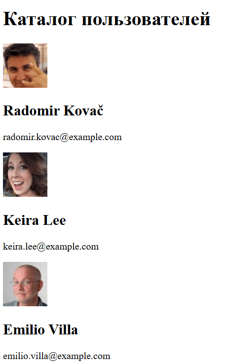

## Каталог пользователей (Random User API)

1. **Настройка проекта**
    
    - Создать новый проект через Vite (`npm create vite@latest catalog --template react`) [vitejs](https://vite.dev/guide/?utm_source=chatgpt.com).
        
    - Установить зависимости и запустить dev‑сервер.
        
2. **Структура компонентов**
    
    - **App.jsx** – верхний компонент, отвечает за загрузку данных.
        
    - **UserCard.jsx** – отображает одного пользователя (аватар, имя, email).
        
3. **Состояния и эффекты**
    
    - В `App` создать состояние `users` и функцию `setUsers` через `useState([])` [React](https://react.dev/reference/react/useEffect?utm_source=chatgpt.com).
        
    - В `useEffect` (с пустым массивом зависимостей) определить функцию `fetchUsers`, которая делает `fetch('https://randomuser.me/api/?results=10')` [Random User Generator](https://randomuser.me/documentation?utm_source=chatgpt.com), парсит JSON и сохраняет `data.results` в `users`.
        
    - Обработать возможные ошибки через `catch` и вывести их в консоль или простое сообщение на странице.
        
4. **Рендер списка**
    
    - В `App` пройтись по `users.map(user => …)` и рендерить `<UserCard key={user.login.uuid} user={user} />`.
        
    - В `UserCard` деструктурировать `user` из `props` и показать `user.picture.medium`, `user.name.first` + `user.name.last`, `user.email`.
        
5. **Стилизация**
    
    - Использовать Tailwind или CSS-модули: грид или flex для раскладки карточек.
        
    - Задать отступы, тени и скругления для `UserCard`.

Примерный итоговый результат
