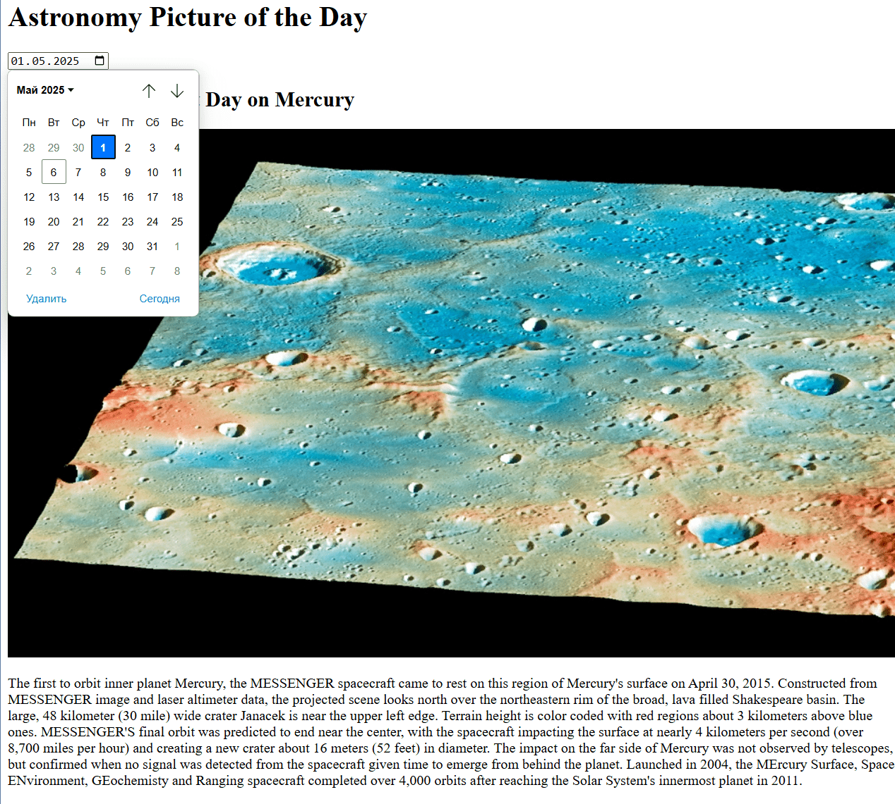

## Галерея снимков NASA APOD

1. **Настройка проекта**
    
    - Аналогично: Vite + React [vitejs](https://vite.dev/guide/?utm_source=chatgpt.com).
        
2. **Структура компонентов**
    
    - **App.jsx** – основная страница с датой и галереей.
        
    - Дополнительный компонент `ApodCard.jsx` (по желанию) для отображения заголовка, картинки и описания.
        
3. **Состояния и эффекты**
    
    - Создать состояния:
        
        - `date` (строка) через `useState('')` [React](https://react.dev/reference/react/useEffect?utm_source=chatgpt.com),
            
        - `apodData` (объект) – `useState(null)`.
            
    - В `useEffect`, срабатывающем при изменении `date`, определить `fetchApod`, делающую `fetch('https://api.nasa.gov/planetary/apod?api_key=DEMO_KEY&date=' + date)` [NASA Open APIs](https://api.nasa.gov/?utm_source=chatgpt.com), парсить JSON и сохранять результат в `apodData`.
        
    - Обработать загрузку (показ «Загрузка…») и ошибки.
        
4. **UI и взаимодействие**
    
    - `<input type="date" value={date} onChange={e => setDate(e.target.value)} />`.
        
    - Кнопка «Загрузить» (опционально) или автозагрузка при выборе даты.
        
    - Если `apodData` не `null`, отобразить `<h2>{apodData.title}</h2>`, ``, `
{apodData.explanation}
`.
        
5. **Стилизация**
    
    - Центрирование, адаптивная верстка (flex‑контейнер или грид).
        
    - Ограничить максимальную ширину контента, скруглить углы картинки.

Примерный итоговый результат
