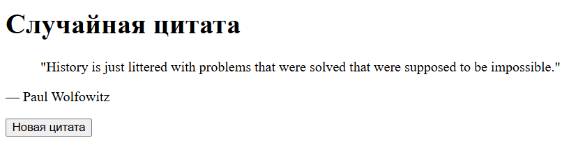

Справочник цитат (thequoteshub.com)
- **Настройка проекта**
    
    - Vite + React [vitejs](https://vite.dev/guide/?utm_source=chatgpt.com).
        
- **Структура компонентов**
    
    - **App.jsx** – загружает случайную цитату.
        
    - Вариант: `QuoteCard.jsx` для отображения текста и автора.
        
- **Состояния и эффекты**
    
    - `quote` через `useState('')`,
        
    - `author` через `useState('')` [React](https://react.dev/reference/react/useEffect?utm_source=chatgpt.com).
        
    - В `useEffect` (пустой массив) определить `fetchQuote`, делающую `fetch('https://thequoteshub.com/api/quotes/${random}')` парсить JSON, доставать `data.data[0]` и сохранять `quoteText` и `quoteAuthor` в состояния.
    
    - Создать константу random при помощи функций `floor` и `random` модуля `Math`
    
    - Кнопка “Новая цитата” просто вызывает `fetchQuote` снова.
        
- **UI и взаимодействие**
    
    - `<blockquote>` для текста, `<cite>` или `
` для автора.
        
    - Кнопка «Новая цитата» с `onClick={fetchQuote}`.
        
- **Стилизация**
    
    - Центрированный блок цитаты с рамкой или фоновым цветом.
        
    - Шрифт italic для цитаты и нормальный для автора.

Примерный итоговый результат
