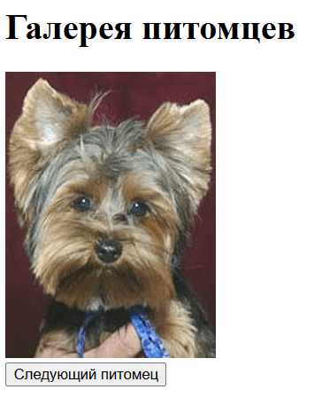

## Галерея случайных питомцев (Dog API)

1. **Переменные**
    - `API_URL` – строка с адресом `https://dog.ceo/api/breeds/image/random` 
    - `container` – ссылка на DOM‑элемент, куда будет вставляться картинка.
    - `button` – ссылка на кнопку «Следующий питомец».
2. **Функция загрузки (`loadPet`)**
    - Устанавливает в `container` текст «Загрузка…».
    - Делаем `fetch(API_URL)`  и ждём ответа.
    - Парсим JSON (`response.json()`), берём поле `message` с URL картинки.
    - Вставляем `` в `container` (через `innerHTML` или `createElement`).
    - В блоке `catch` выводим «Ошибка загрузки».
3. **События и инициализация**
    - По `button.addEventListener('click', loadPet)` вызываем `loadPet` при клике.
    - Один раз вызываем `loadPet()` при загрузке страницы.
4. **HTML/CSS**
    - Семантический блок `<main>` с заголовком, контейнером изображений и кнопкой.
    - Flexbox/CSS Grid для центрирования и ограничения максимальной ширины.

Примерный итоговый результат
