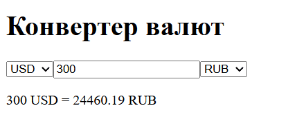

## Калькулятор валют (ExchangeRate‑API)

1. **Настройка проекта**
    
    - Vite + React [vitejs](https://vite.dev/guide/?utm_source=chatgpt.com).
        
2. **Структура компонентов**
    
    - **App.jsx** – одна страница с селекторами и результатом.
        
    - Вариант: выделить компоненты `CurrencySelect.jsx`, `AmountInput.jsx`, `ResultDisplay.jsx`.
        
3. **Состояния и эффекты**
    
    - `baseCurrency` через `useState('USD')`,
        
    - `rates` как объект через `useState({})`,
        
    - `amount` через `useState(1)`,
        
    - `targetCurrency` через `useState('EUR')` [React](https://react.dev/reference/react/useEffect?utm_source=chatgpt.com).
        
    - В `useEffect`, зависящем от `baseCurrency`, делать `fetch('https://open.er-api.com/v6/latest/' + baseCurrency)` [ExchangeRate-API](https://www.exchangerate-api.com/docs/overview?utm_source=chatgpt.com), парсить JSON и сохранять `data.rates` в `rates`.
        
    - Обновлять результат в рендере: `const converted = (amount * rates[targetCurrency]).toFixed(2)`.
        
4. **UI и взаимодействие**
    
    - `<select value={baseCurrency} onChange={…}>` для списка кодов валют (ключи объекта `rates`).
        
    - `<input type="number" value={amount} onChange={…} />`.
        
    - `<select value={targetCurrency} onChange={…}>`.
        
    - `
{amount} {baseCurrency} = {converted} {targetCurrency}
`.
        
5. **Стилизация**
    
    - Формат сетки или флекса для поля ввода и селектов.
        
    - Кнопка “Обновить” (опционально) или автопересчет при изменении состояний.

Примерный итоговый результат
